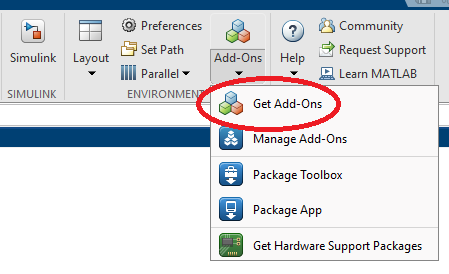
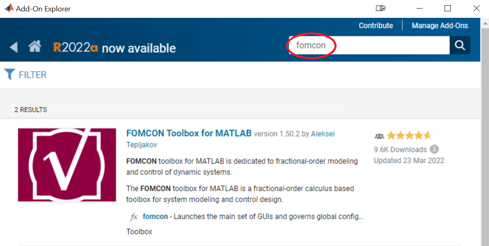

# FOMCON Toolbox for MATLAB

FOMCON toolbox for MATLAB.

Version compatibility: R2014b+

May be compatible with MATLAB down to R2010a as well (but with a 

# Installation Instructions

## Prerequisites

The following MATLAB toolboxes are required for FOMCON to work:

* Control System toolbox;
* Optimization toolbox.
  However, even if the Optimization toolbox is not available in the MATLAB installation, it is still possible to use certain toolbox features.

## Installation

### Automatic

In recent MATLAB versions, locate the Add-On Explorer:

There, search for FOMCON:

Click on the title and then on `Add`. Agree to the terms and install the toolbox. You're done!

### Manual, for older MATLAB versions

The installation currently comprises the following steps:

* Decompress the zipped folder into a directory of your choice, e.g. *C:\fomcon\*
* Setup the directory in your MATLAB path. In the MATLAB, go to *File > Set Path...* and click on *Add with Subfolders...*. Now, select the directory that contains the *fomcon* folder.
* Save the path for future MATLAB sessions (usually administrator priveleges are necessary). This completes the installation.

### Checking if installation succeeded

In MATLAB, type `fomcon`. If you can see a graphical user interface, the toolbox has been successfully installed.

# Support

If you encounter problems, please open corresponding issues on GitHub: [Issues · extall/fomcon-matlab · GitHub](https://github.com/extall/fomcon-matlab/issues)

Support is also offered through the official website at http://fomcon.net/ through the documentation.

## Citing FOMCON Toolbox in Academic Works

If you find FOMCON useful in your research projects, kindly cite one or more of the following references choosing the one that is most suitable for your particular research topic. This helps exposing the toolbox to potential future users.

Newest book chapter about FOMCON:

* A. Tepljakov, E. Petlenkov, and J. Belikov, FOMCON toolbox for modeling, design and implementation of fractional-order control systems. Applications in Control. DOI: https://doi.org/10.1515/9783110571745-010. De Gruyter, Berlin/Munich/Boston, 2019.

Older publications:

* A. Tepljakov, E. Petlenkov, and J. Belikov, “Gain and Order Scheduled Fractional-order PID Control Of Fluid Level in a Multi-Tank System,” in 2014 International Conference on Fractional Differentiation and its Applications, 2014, pp. 1–6.
* A. Tepljakov, E. Petlenkov, and J. Belikov, “Closed-Loop Identification of Fractional-order Models using FOMCON Toolbox for MATLAB,” in Proc. 14th Biennial Baltic Electronics Conference, 2014, pp. 213–216.
* A. Tepljakov, E. Petlenkov, and J. Belikov, “Efficient analog implementations of fractional-order controllers,” in Proc. of the 14th International Carpathian Control Conference (ICCC), 2013, pp. 377–382.
* A. Tepljakov, E. Petlenkov, J. Belikov, and J. Finajev, “Fractional-order controller design and digital implementation using FOMCON toolbox for MATLAB,” in Proc. of the 2013 IEEE Multi-Conference on Systems and Control conference, 2013, pp. 340–345.
* A. Tepljakov, E. Petlenkov, J. Belikov, and M. Halás, “Design and Implementation of Fractional-order PID Controllers for a Fluid Tank System,” in Proc. 2013 American Control Conference (ACC), Washington DC, USA, 2013, pp. 1780–1785.
* A. Tepljakov, E. Petlenkov, and J. Belikov, “FOMCON: a MATLAB toolbox for fractional-order system identification and control,” International Journal of Microelectronics and Computer Science, vol. 2, no. 2, pp. 51–62, 2011.
* A. Tepljakov. (2012) FOMCON: Fractional-order Modeling and Control. [Online]. Available: http://www.fomcon.net/

Your support is appreciated!
